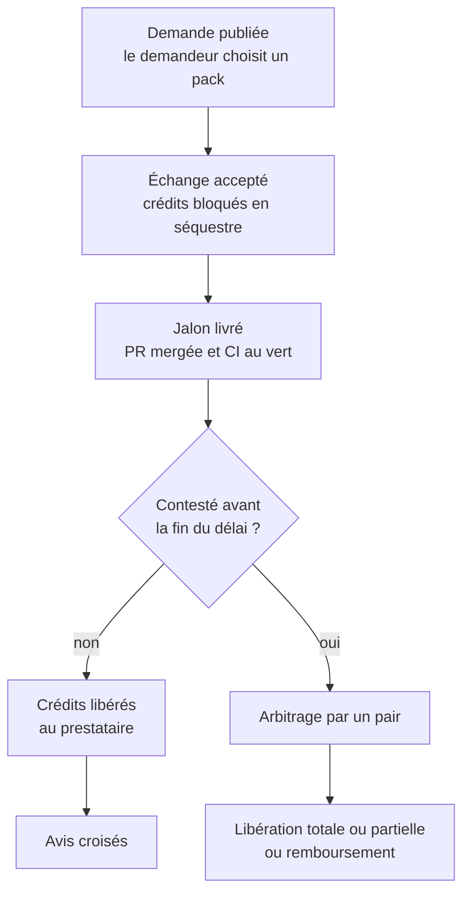
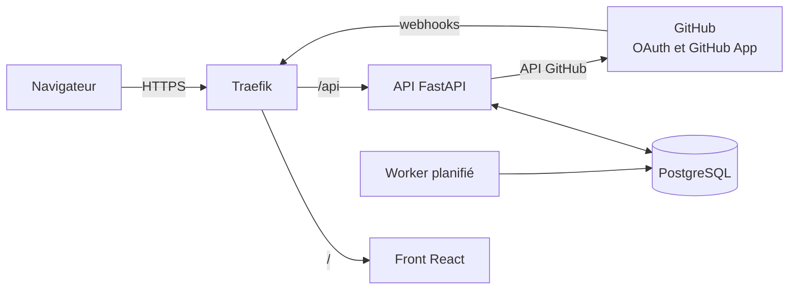

# CodeTroc

**Le réseau d'entraide où les développeurs échangent du temps de code, pas de l'argent.**


---

## Sommaire

- [Le projet](#le-projet)
- [Comment ça marche](#comment-ça-marche)
- [Fonctionnalités](#fonctionnalités)
- [Architecture](#architecture)
- [Démarrage rapide](#démarrage-rapide)
- [Configuration GitHub](#configuration-github)
- [Développement](#développement)
- [Sécurité](#sécurité)
- [Feuille de route](#feuille-de-route)
- [Rejoindre la communauté](#rejoindre-la-communauté)
- [Équipe](#équipe)

---

## Le projet

### Le problème

Beaucoup de développeurs ont un projet bloqué faute d'une compétence complémentaire, sans budget pour la payer. Le backend n'a pas de front, le front n'a pas d'infra, et le junior n'a pas de vraies missions à montrer.

Les plateformes freelance garantissent la livraison, mais coûtent de l'argent. Les plateformes de troc sont gratuites, mais sans garantie : les échanges s'arrêtent à mi-chemin et la confiance s'effrite.

### La solution

Sur CodeTroc, chacun rend un service à un autre membre (pipeline CI/CD, infra Docker, interface React…) et gagne des **crédits**. Ces crédits se dépensent ensuite auprès de **n'importe quel membre** de la communauté.

La confiance repose sur des preuves, pas sur des promesses :

- **Packs standardisés** : chaque service a un livrable, des critères d'acceptation et un prix en crédits.
- **Séquestre par jalon** : les crédits sont bloqués dès l'accord, puis libérés à la livraison.
- **Preuve de livraison automatique** : une PR mergée avec une CI au vert valide le jalon.

### Une communauté avant tout

- Chaque crédit gagné vient d'un service rendu à un pair : personne ne crée de crédits à partir de rien.
- Les litiges sont arbitrés par des membres expérimentés de la communauté.
- La réputation repose sur des livraisons prouvées, liées à de vrais dépôts.
- Juniors et seniors progressent ensemble sur de vrais projets, et la revue de code est un service comme un autre.

---

## Comment ça marche



### Exemples de packs

| Pack | Livrable | Critère d'acceptation |
| --- | --- | --- |
| Dockeriser une application | Dockerfile, docker-compose, README | `docker compose up` lance l'app sans étape manuelle |
| Pipeline CI/CD GitHub Actions | Workflow lint, tests, build, déploiement | Pipeline vert sur la branche principale |
| Intégration de maquette React | Composants réutilisables | Rendu conforme à la maquette |
| Tests unitaires d'un module | Suite de tests | Tests verts en CI |
| Revue de code d'une PR | Commentaires + rapport | Points bloquants identifiés |

### Le grand livre de crédits

- **Crédit mutuel** : un crédit n'est jamais imprimé, il passe d'un compte à un autre. La somme de tous les soldes reste à zéro.
- **Double entrée** : chaque mouvement débite un compte et en crédite un autre (membre, séquestre de contrat, fonds d'arbitrage).
- **Ajout seul** : aucune écriture n'est modifiée ni supprimée. Le solde d'un membre est la somme de ses écritures.
- **Avance de démarrage** : un nouveau membre peut descendre à un solde négatif plafonné pour recevoir avant de donner.

---

## Fonctionnalités

### MVP

- [ ] Connexion avec GitHub (OAuth) et profil de compétences offertes et recherchées
- [ ] Catalogue de packs et publication d'offres et de demandes
- [ ] Contrats à jalons entre deux membres
- [ ] Portefeuille : solde, avance de démarrage, historique des mouvements
- [ ] Séquestre : blocage à l'acceptation, libération à la validation
- [ ] Validation de jalon manuelle ou par webhook GitHub (PR mergée, checks verts)
- [ ] Libération automatique après le délai de contestation
- [ ] Avis croisés après chaque échange

---

## Architecture



| Couche | Technologie | Rôle |
| --- | --- | --- |
| Front | React | Interface web servie en statique |
| API | FastAPI | Logique métier, authentification, webhooks GitHub |
| Base de données | PostgreSQL | Comptes, contrats, jalons, grand livre |
| Worker | Python | Libération automatique des crédits après le délai |
| Reverse proxy | Traefik | HTTPS, routage front / API, limitation de débit |
| CI/CD | GitHub Actions | Tests, build et déploiement |

### Structure du dépôt

```text
codetroc/
├── frontend/              # Application React
├── backend/
│   ├── app/
│   │   ├── api/           # Routes FastAPI
│   │   ├── models/        # Modèles de données
│   │   ├── ledger/        # Grand livre de crédits
│   │   ├── github/        # OAuth, GitHub App, webhooks
│   │   └── worker.py      # Tâches planifiées
│   ├── alembic/           # Migrations de base de données
│   └── tests/
├── traefik/               # Configuration Traefik
├── docker-compose.yml
├── .env.example
└── .github/workflows/     # CI/CD
```
