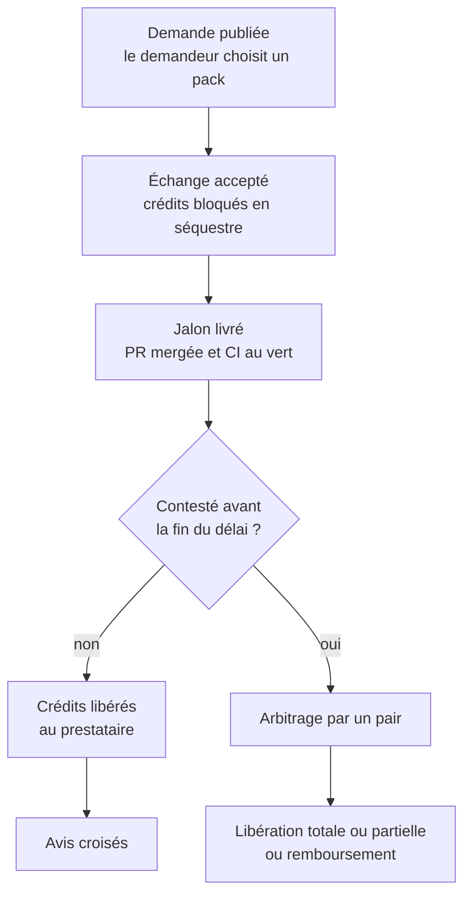
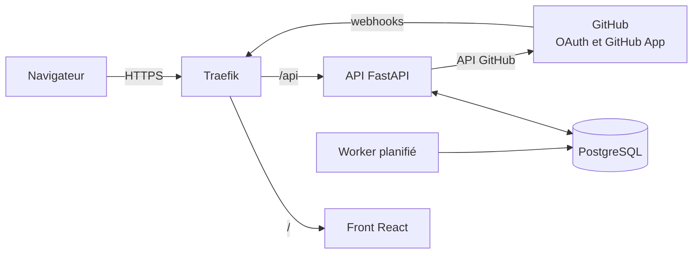

# CodeTroc

**Le réseau d'entraide où les développeurs échangent du temps de code, pas de l'argent.**


---

## Sommaire

- [Le projet](#le-projet)
- [Comment ça marche](#comment-ça-marche)
- [Fonctionnalités](#fonctionnalités)
- [Architecture](#architecture)
- [Démarrage rapide](#démarrage-rapide)
- [Configuration GitHub](#configuration-github)
- [Développement](#développement)
- [Sécurité](#sécurité)
- [Feuille de route](#feuille-de-route)
- [Rejoindre la communauté](#rejoindre-la-communauté)
- [Équipe](#équipe)

---

## Le projet

### Le problème

Beaucoup de développeurs ont un projet bloqué faute d'une compétence complémentaire, sans budget pour la payer. Le backend n'a pas de front, le front n'a pas d'infra, et le junior n'a pas de vraies missions à montrer.

Les plateformes freelance garantissent la livraison, mais coûtent de l'argent. Les plateformes de troc sont gratuites, mais sans garantie : les échanges s'arrêtent à mi-chemin et la confiance s'effrite.

### La solution

Sur CodeTroc, chacun rend un service à un autre membre (pipeline CI/CD, infra Docker, interface React…) et gagne des **crédits**. Ces crédits se dépensent ensuite auprès de **n'importe quel membre** de la communauté.

La confiance repose sur des preuves, pas sur des promesses :

- **Packs standardisés** : chaque service a un livrable, des critères d'acceptation et un prix en crédits.
- **Séquestre par jalon** : les crédits sont bloqués dès l'accord, puis libérés à la livraison.
- **Preuve de livraison automatique** : une PR mergée avec une CI au vert valide le jalon.

### Une communauté avant tout

- Chaque crédit gagné vient d'un service rendu à un pair : personne ne crée de crédits à partir de rien.
- Les litiges sont arbitrés par des membres expérimentés de la communauté.
- La réputation repose sur des livraisons prouvées, liées à de vrais dépôts.
- Juniors et seniors progressent ensemble sur de vrais projets, et la revue de code est un service comme un autre.

---

## Comment ça marche



### Exemples de packs

| Pack | Livrable | Critère d'acceptation |
| --- | --- | --- |
| Dockeriser une application | Dockerfile, docker-compose, README | `docker compose up` lance l'app sans étape manuelle |
| Pipeline CI/CD GitHub Actions | Workflow lint, tests, build, déploiement | Pipeline vert sur la branche principale |
| Intégration de maquette React | Composants réutilisables | Rendu conforme à la maquette |
| Tests unitaires d'un module | Suite de tests | Tests verts en CI |
| Revue de code d'une PR | Commentaires + rapport | Points bloquants identifiés |

### Le grand livre de crédits

- **Crédit mutuel** : un crédit n'est jamais imprimé, il passe d'un compte à un autre. La somme de tous les soldes reste à zéro.
- **Double entrée** : chaque mouvement débite un compte et en crédite un autre (membre, séquestre de contrat, fonds d'arbitrage).
- **Ajout seul** : aucune écriture n'est modifiée ni supprimée. Le solde d'un membre est la somme de ses écritures.
- **Avance de démarrage** : un nouveau membre peut descendre à un solde négatif plafonné pour recevoir avant de donner.

---

## Fonctionnalités

### MVP

- [ ] Connexion avec GitHub (OAuth) et profil de compétences offertes et recherchées
- [ ] Catalogue de packs et publication d'offres et de demandes
- [ ] Contrats à jalons entre deux membres
- [ ] Portefeuille : solde, avance de démarrage, historique des mouvements
- [ ] Séquestre : blocage à l'acceptation, libération à la validation
- [ ] Validation de jalon manuelle ou par webhook GitHub (PR mergée, checks verts)
- [ ] Libération automatique après le délai de contestation
- [ ] Avis croisés après chaque échange

---

## Architecture



| Couche | Technologie | Rôle |
| --- | --- | --- |
| Front | React | Interface web servie en statique |
| API | FastAPI | Logique métier, authentification, webhooks GitHub |
| Base de données | PostgreSQL | Comptes, contrats, jalons, grand livre |
| Worker | Python | Libération automatique des crédits après le délai |
| Reverse proxy | Traefik | HTTPS, routage front / API, limitation de débit |
| CI/CD | GitHub Actions | Tests, build et déploiement |

### Structure du dépôt

```text
codetroc/
├── frontend/              # Application React
├── backend/
│   ├── app/
│   │   ├── api/           # Routes FastAPI
│   │   ├── models/        # Modèles de données
│   │   ├── ledger/        # Grand livre de crédits
│   │   ├── github/        # OAuth, GitHub App, webhooks
│   │   └── worker.py      # Tâches planifiées
│   ├── alembic/           # Migrations de base de données
│   └── tests/
├── traefik/               # Configuration Traefik
├── docker-compose.yml
├── .env.example
└── .github/workflows/     # CI/CD
```

---

## Démarrage rapide

### Prérequis

- Docker et Docker Compose
- Un compte GitHub pour créer une OAuth App et une GitHub App (voir [Configuration GitHub](#configuration-github))

### Lancement

```bash
git clone https://github.com/<ORGANISATION>/codetroc.git
cd codetroc
cp .env.example .env        # puis renseigner les variables ci-dessous
docker compose up -d --build
docker compose exec backend alembic upgrade head
docker compose exec backend python -m app.seed   # données de démo (optionnel)
```

L'application est ensuite disponible sur `http://localhost`, et l'API sur `http://localhost/api`. La documentation interactive de l'API est générée par FastAPI sur `http://localhost/api/docs`.

### Variables d'environnement

| Variable | Description |
| --- | --- |
| `POSTGRES_USER`, `POSTGRES_PASSWORD`, `POSTGRES_DB` | Accès à la base PostgreSQL |
| `DATABASE_URL` | URL de connexion utilisée par l'API et le worker |
| `SECRET_KEY` | Clé de signature des sessions |
| `GITHUB_CLIENT_ID`, `GITHUB_CLIENT_SECRET` | Identifiants de l'OAuth App |
| `GITHUB_APP_ID`, `GITHUB_APP_PRIVATE_KEY_PATH` | Identifiants de la GitHub App |
| `GITHUB_WEBHOOK_SECRET` | Secret de signature des webhooks |
| `DOMAIN` | Domaine public (production) |
| `ACME_EMAIL` | E-mail pour les certificats Let's Encrypt (production) |
| `CONTEST_DELAY_HOURS` | Délai de contestation avant libération automatique |
| `STARTER_ADVANCE` | Plafond de l'avance de démarrage, en crédits |

---

## Configuration GitHub

1. **OAuth App** (connexion des membres) : dans *Settings → Developer settings → OAuth Apps*, déclarer l'URL de rappel `http://localhost/api/auth/github/callback`.
2. **GitHub App** (preuves de livraison) : dans *Settings → Developer settings → GitHub Apps*, créer une application avec :
    - permissions en lecture seule : *Pull requests*, *Checks*, *Metadata* ;
    - événements : `pull_request` et `check_suite` ;
    - URL de webhook : `https://<DOMAINE>/api/webhooks/github`, avec le secret défini dans `GITHUB_WEBHOOK_SECRET`.
3. **En local**, GitHub ne peut pas joindre `localhost` : utiliser un relais de webhooks comme [smee.io](https://smee.io) pour les transmettre à l'API.

---

## Développement

### Sans Docker

```bash
# API
cd backend
python -m venv .venv && source .venv/bin/activate
pip install -r requirements.txt
uvicorn app.main:app --reload

# Front
cd frontend
npm install
npm run dev
```

### Tests

```bash
cd backend && pytest
cd frontend && npm test
```

---

## Sécurité

- La signature HMAC de chaque webhook GitHub est vérifiée avant traitement.
- La GitHub App ne demande que des permissions en lecture.
- Chaque mouvement de crédits s'exécute dans une transaction, avec contrôle du solde côté base.
- Les secrets restent dans `.env` ou dans les secrets Docker, jamais dans le dépôt.
- Traefik limite le débit des routes sensibles (connexion, contrats, webhooks).

Pour signaler une vulnérabilité, merci de contacter l'équipe en privé plutôt que d'ouvrir une issue publique.

---

## Feuille de route

**V2**

- [ ] Coffre d'accès sécurisé : accès temporaires aux dépôts et serveurs, révocation automatique, journal d'audit
- [ ] Arbitrage par les pairs, rémunéré par un fonds commun
- [ ] Suggestions d'échanges fondées sur le catalogue et l'historique
- [ ] Notifications par e-mail, Discord ou Slack

**Vision**

- [ ] Échanges circulaires : A aide B, B aide C, C aide A
- [ ] Portfolio vérifié : chaque échange terminé devient une preuve de compétence
- [ ] Espaces dédiés pour les écoles, bootcamps, meetups et incubateurs

---

## Rejoindre la communauté

CodeTroc se construit avec sa communauté, et toutes les contributions comptent.

- **Signaler un bug ou proposer une idée** : ouvrir une issue.
- **Proposer un nouveau pack** : ouvrir une issue décrivant le livrable, les critères d'acceptation et la fourchette de crédits envisagée.
- **Contribuer au code** : forker le dépôt, créer une branche, puis ouvrir une pull request. Les issues `good first issue` sont un bon point de départ.

Merci de rester bienveillant et respectueux dans tous les échanges : l'entraide est la raison d'être du projet.

---

## Équipe

| Membre | Rôle |
| --- | --- |
| `<NOM>` | `<RÔLE>` |
| `<NOM>` | `<RÔLE>` |

---

## Licence

`<À DÉFINIR>`
